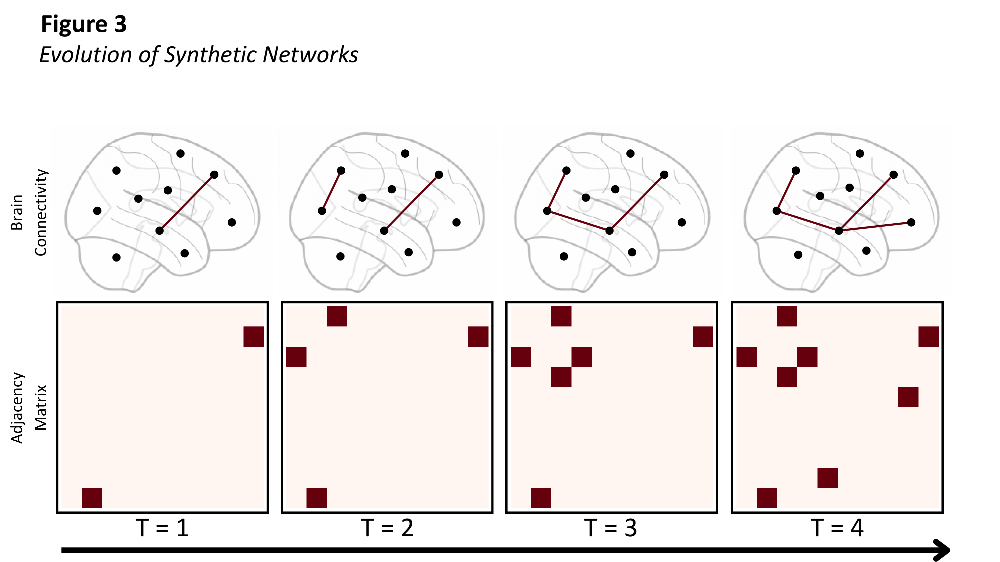
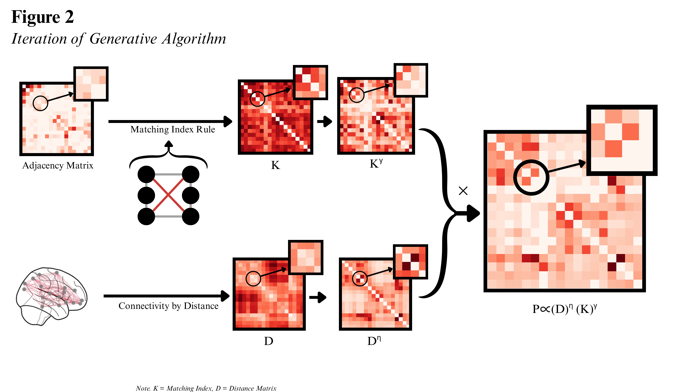

# Binary Generative Network Models

## Historical Background

[ Leave blank for now ]

## The Binary Generative Network Model

The binary generative network model (henceforth, GNM) builds networks by iteratively adding edges to an established layout of nodes. Under certain conditions, it can generate networks with significant topological similarity to real brain networks. In principle, GNMs could be used to model any kind of network; however, we will restrict our attention to the challenge of modelling brain networks. The pattern of connectivity between these regions is [represented by](networks-and-graphs.md#representing-networks) an [adjacency matrix](glossary.md#adjacency-matrix-a), $A_{ij}$.

The algorithm at the heart of a standard GNM is very simple. The model begins with an [adjacency matrix](glossary.md#adjacency-matrix-a), $A_{ij}$, which can be either empty (zeros everywhere) or already contain some connections (sometimes termed the `seed network'). At each step of the algorithm, we compute a likelihood that every currently unconnected pair of nodes will form a connection. We then sample a pair of nodes randomly according to this distribution. An edge is then added between the sampled nodes. This cycle then repeats, with edges being added one-by-one until one-by-one until a desired total number of connections is reached. Depending upon the equation used to compute the probability that new connections will form - which we will come to shortly - the current pattern of network connectivity can influence the likelihood of which connections will form at the next step. Thus, GNMs display path-dependency - the current state of the network can determine the likelihood of different subsequent states, such that two networks that begin only slightly differently may end up looking very different at the end of the process.  

Within a GNM, the [likelihood of a connection forming at each step](#computing-wiring-probabilities) depends on both the distance and affinity between the nodes. Distance captures spatial constraints on wiring, and in general the further two nodes are physically separated from each other the less likely a connection is to form between them. The influence of distance on wiring probabilities is controlled through a parameter $\eta$. In most implementations of the GNM we approximate distance to simply as Euclidean distance, that is, the physical separation of nodes in space. There have also been attempts to use alternative distance measures, for example the length of fibres between nodes. The distance matrix is the first component which influences the likelihood of connections forming. Thhe second influence comes from the affinity matrix. Affinity captures non-spatial topological factors that influence connection formation. As discussed [below](#computing-the-affinity-matrix), there are many different methods for computing the [affinity matrix](glossary.md#affinity-matrix-k), denoted $K$, each giving rise to different growth dynamics and final network structures. The influence of affinity on wiring probabilities is controlled through a parameter $\gamma$. 

Because the sampling of edges is performed at random, GNMs are fundamentally stochastic: running the model for the same set of parameters ($\eta, \gamma$) repeatedly can result in very different final networks. In fact, this stochasticity itself will vary systematically depending on the values of the parameters. In general, there is no way for us to say the probability that a particular network will be generated via the GNM under some set of parameters; instead, we typically explore model outputs by running many copies of the model for the same parameters ($\eta, \gamma$) to examine the distribution of networks the model produces for that parameter set. By comparing these distributions across different parameter pairs, we can find the set of parameters which yields networks which most often have the same topological properties found in real brain networks. This method of determining model parameters is described in more detail in [subsequent sections](fitting-gnms.md#fitting-generative-network-models).

### Computing Wiring Probabilities

At each step of the GNM, we must compute [wiring probabilities](glossary.md#wiring-probabilities) $P_{ij}$ that each pair of currently unconnected nodes will form a connection. We begin by computing *unnormalised* wiring probabilities using both the distance and affinity matrices, $D$ and $K$ as follows.  

The distance matrix $D$ measures the physical separation in space between nodes; $D_{ij}$ is equal to the distance between nodes $i$ and $j$. From the distance matrix, we obtain a [distance transform](glossary.md#distance-transform) $d_{ij}$ dependent on both the parameter $\eta$ and on the distance relationship type. When the distance relationship type is exponential, the distance transform is computed as $d_{ij} = \exp( \eta D_{ij} )$. When the distance relationship type is powerlaw, the distance transform is computed as $d_{ij} = D^{\eta}$. Similarly, from the [affinity matrix](glossary.md#affinity-matrix) $K_{ij}$ we obtain an [affinity transform](glossary.md#affinity-transform) $k_{ij}$ using parameter $\gamma$. When the affinity relationship type is exponential, the affinity transform is $k_{ij} = \exp( \gamma K_{ij} )$; when the affinity relationship type is powerlaw, the affinity transform is $k_{ij} = K_{ij}^\gamma$. 

To combine the geometric information contained in the [distance transform](glossary.md#distance-transform), $d_{ij}$, with the non-geometric, topological information contained in the [affinity transform](glossary.md#affinity-transform), $k_{ij}$, we multiply these together to produce unnormalised wiring probabilities, 

$$ 
\tilde{P}_{ij} = d_{ij} \times k_{ij}. 
$$ 

Several important constraints are then applied to these unnormalised probabilities. Existing [edges](glossary.md#edge) have their probabilities set to zero, since we can only add new edges between nodes not already connected. This can be accomplished by multiplying the unnormalised probabilities by $(1 - A_{ij})$, which is $0$ when $i$ and $j$ are adjacent ($A_{ij} = 1$) and $1$ when they are not currently connected ($A_{ij} = 0$). Since nodes cannot form edges to themselves (*i.e.*, self-connections are prohibited), we set the diagonal terms to $0$, $\tilde{P}_{ii} = 0$. Finally, we normalised the probabilities by dividing by their sum to ensure the sum of the normalised probabilities is $1$. 

After sampling from the normalised probabilities and adding the selected connection to the [network](glossary.md#network), the process iterates. The [affinity matrix](glossary.md#affinity-matrix-k) is recomputed based on the updated [adjacency matrix](glossary.md#adjacency-matrix-a), new unnormalised and normalised [wiring probabilities](glossary.md#wiring-probabilities-p_ij) are calculated, and sampling continues. This iteration continues until the desired number of [edges](glossary.md#edge) is reached.

  

    
Algorithm: The Binary Generative Network Model

    
    

      
<strong>Input</strong>: (Possibly empty) seed adjacency matrix, \(A_{ij}\)

      
      
<strong>For</strong> number of binary updates <strong>do</strong>:

      <ol>
        <li>Compute distance transform \(d_{ij} = D_{ij}^\eta\) if distance relationship type is powerlaw and \(d_{ij} = \exp( \eta D_{ij} )\) if the distance relationship type is exponential.</li>
        <li>Compute affinity matrix \(K_{ij}\) from current adjacency matrix \(A_{ij}\).</li>
        <li>Compute affinity transform \(k_{ij} = K_{ij}^\gamma\) if affinity relationship type is powerlaw and \(k_{ij} = \exp( \gamma K_{ij})\) if the affinity relationship type is exponential.</li>
        <li>Compute unnormalised connection probabilities as the product of the distance and affinity transforms: 
            $$\tilde{P}_{ij} \gets k_{ij} \times d_{ij} $$</li>
        <li>Set probability of already present edges to zero: \(\tilde{P}_{ij} \gets (1 - A_{ij}) \tilde{P}_{ij}\)</li>
        <li>Set probability of self-connections to zero: \(\tilde{P}_{ii} \gets 0\)</li>
        <li>Normalise wiring probabilities:
            $$P_{ij} \gets \frac{\tilde{P}_{ij}}{ \sum_{ab} \tilde{P}_{ab} }$$</li>
        <li>Sample edge \((i,j)\) with probability \(P_{ij}\)</li>
        <li>Add edge to the adjacency matrix: \(A_{ij} \gets 1\) and \(A_{ji} \gets 1\)</li>
      </ol>
      
<strong>End for</strong>

      
      
<strong>Return</strong>: Adjacency matrix \(A_{ij}\)

    

  

### Computing the Affinity Matrix

The [affinity matrix](glossary.md#affinity-matrix-k) $K_{ij}$ captures an arbitrary non-geometric factor influencing the likelihood that [nodes](glossary.md#node) form [edges](glossary.md#edge) between them, depending on the current pattern of connectivity in the network. Different [generative rules](glossary.md#generative-rule) provide various methods for computing the affinity matrix $K$ on the basis of the adjacency matrix $A$. There are three main classes of generative rules implemented within the toolbox - [degree-based rules](glossary.md#degree), [clustering-based rules](glossary.md#clustering-coefficient), and [homphily rules](glossary.md#homophily). 

Degree-based rules are built off the [degree](glossary.md#degree) of each node, $s_i$ ([defined](networks-and-graphs.md#node-level-measures) as the number of [neighbours](glossary.md#neighbour) of node $i$). The degree difference method compute $K_{ij} = |s_i - s_j|$, and thereby assigns a higher affinity to connections between nodes which currently have similar degree. The degree minimum method computes $K_{ij} = \min(s_i, s_j)$, and so assigns a higher affinity to connections into nodes which currently have a high degree. Within the degree class we also have degree maximum, average, and product methods. See the table below for definitions of these. Clustering-based rules are computed via analogous formulae, except using the clustering coefficients $c_i$ instead of the degrees. 

[Homophily](glossary.md#homophily) rules instead assign a higher affinity to conenctions between nodes that already have a similar connection profile. There are two homophily rules implemented within the toolbox: Neighbours and Matching Index. Neighbours computes the affinity as the number of neighbours shared between two nodes. Accordingly, when two nodes share a large number of neighbours, they will have a high affinity. Note that neighbours will, in general, assign a higher affinity to connections into nodes which have high degree, since having a high number of neighbours means that you will be more likely to share those neighbours with any other node. Matching Index controls for this by instead computing the affinity between $i$ and $j$ as the fraction of nodes connected to either $i$ or $j$ which are connected to *both* $i$ and $j$. See the table below for a precise definition.    

Although the affinity matrices detailed here are all based on the current topology of the network, affinity matrices can (in theory) be based on any non-spatial features. For example, the affinity matrix could be computed from gene expression similarity, or the current functional connectivity of the network. 

  
Table: Methods for computing the affinity matrix, \(K\)

  
  <table class="gnm-table">
    <thead>
      <tr>
        <th>Rule type</th>
        <th>Rule name</th>
        <th>\(K_{ij}\)</th>
        <th>Notes</th>
      </tr>
    </thead>
    <tbody>
      <tr>
        <td rowspan="5">Degree rules</td>
        <td>Degree average</td>
        <td class="formula-column">\(\frac{s_i + s_j}{2}\)</td>
        <td rowspan="5" class="notes-column">The degree of node \(i\) is the total number of neighbours of \(i\), $$s_i = \sum_j A_{ij}$$</td>
      </tr>
      <tr>
        <td>Degree difference</td>
        <td class="formula-column">\(|s_i - s_j|\)</td>
      </tr>
      <tr>
        <td>Degree maximum</td>
        <td class="formula-column">\(\max(s_i,s_j)\)</td>
      </tr>
      <tr>
        <td>Degree minimum</td>
        <td class="formula-column">\(\min(s_i,s_j)\)</td>
      </tr>
      <tr>
        <td>Degree product</td>
        <td class="formula-column">\(s_i \times s_j\)</td>
      </tr>
      <tr>
        <td rowspan="5">Clustering rules</td>
        <td>Clustering average</td>
        <td class="formula-column">\(\frac{c_i + c_j}{2}\)</td>
        <td rowspan="5" class="notes-column">The clustering coefficient \(c_i\) is the proportion of \(i\)'s neighbours which are neighbours of each other, $$c_i = \frac{\left[ A^3 \right]_{ii} }{ s_i(s_i -1) }$$</td>
      </tr>
      <tr>
        <td>Clustering difference</td>
        <td class="formula-column">\(|c_i - c_j|\)</td>
      </tr>
      <tr>
        <td>Clustering maximum</td>
        <td class="formula-column">\(\max(c_i,c_j)\)</td>
      </tr>
      <tr>
        <td>Clustering minimum</td>
        <td class="formula-column">\(\min(c_i,c_j)\)</td>
      </tr>
      <tr>
        <td>Clustering product</td>
        <td class="formula-column">\(c_i \times c_j\)</td>
      </tr>
      <tr>
        <td rowspan="2">Homophily rules</td>
        <td>Matching Index</td>
        <td class="formula-column">\(\frac{ \sum_m A_{im}A_{mj} }{\sum_m \max(A_{im},A_{mj})}\)</td>
        <td class="notes-column">The number of neighbours \(i\) and \(j\) have in common, divided by the total number of nodes connected to either node.</td>
      </tr>
      <tr>
        <td>Neighbours</td>
        <td class="formula-column">\(\sum_m A_{im}A_{mj}\)</td>
        <td class="notes-column">The number of neighbours \(i\) and \(j\) have in common.</td>
      </tr>
      <tr>
        <td>Geometric rule</td>
        <td>Geometric</td>
        <td class="formula-column">\(1\)</td>
        <td class="notes-column">Distance factor only contributes to wiring probabilities.</td>
      </tr>
    </tbody>
  </table>

## Applications of GNMs

[ Leave blank for now ]